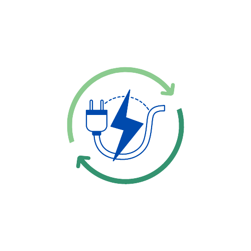

<p align="center">
  <a href="#">
    
  </a>
</p>

<h1 align="center">⚡ Energy Monitor</h1>

<p align="center">
  Tenha o controle do consumo dos seus eletrodomésticos com o <strong>Energy Monitor</strong>.
</p>


## 🚀 Tecnologias Utilizadas  

<p align="center">
  
  
  
  
  
</p>


## 🔍 Visão Geral  

O **Energy Monitor** é uma aplicação de monitoramento de energia em tempo real que permite que os usuários acompanhem o consumo elétrico de seus eletrodomésticos. Isso ajuda no controle dos gastos e na otimização do consumo de energia.

---

## 📋 Pré-requisitos  

Antes de começar, certifique-se de ter os seguintes requisitos instalados:

- Python 3  
- MySQL  
- PHP 8.2  
- Laravel  
- Node.js  
- Git  
- NPM na versão estável  

---

## 🔧 Executando o Projeto  

### 1️⃣ Clonando o repositório e iniciando a configuração  

Abra um terminal e execute:  

```bash
git clone https://github.com/davifurao/Energy-Monitor.git
cd Energy-Monitor/IOT
sudo apt-get update && sudo apt-get upgrade
sudo bash verificacao.sh
sudo docker compose up --build
```
### 2️⃣ Executando o Publisher
O publisher precisará enviar dados simulando o funcionamento de um dispositivo IoT.Abra um segundo terminal e execute:

```bash
cd Energy-Monitor/IOT
python3 publisher.py
```

### 3️⃣ Executando o Subscriber (com insert no Banco de Dados)
O subscriber é um microserviço que precisará ser executado a todo momento para receber a mensagem MQTT. Portanto abra um terceiro terminal e execute:

```bash
cd Energy-Monitor/IOT
python3 subscriber-with-BD.py
```

### 4️⃣ Configurando a Aplicação
Na sua IDE , abra a pasta Aplicação:
1.  Copie o arquivo <strong>.env.example</strong> e renomeie para <strong>.env</strong> lembrando de alterar as variaveis referentes a sua infra, como dados de login ao MySQL.
2.  Abra o arquivo <strong>.env</strong> e insira as configurações do banco de dados.


### 5️⃣ Instalando Dependências
Execute:

```bash
cd Energy-Monitor/aplicacao
composer install
php artisan key:generate
php artisan migrate
php artisan serve
```
## 🎁 Agradecimentos
Agradecemos a todos que participaram e apoiaram este projeto! Vocês são incríveis! 😃

## 📄 Licença
Este projeto está sob a licença <a href='https://github.com/davifurao/Energy-Monitor/blob/main/LICENSE'>MIT</a>.
